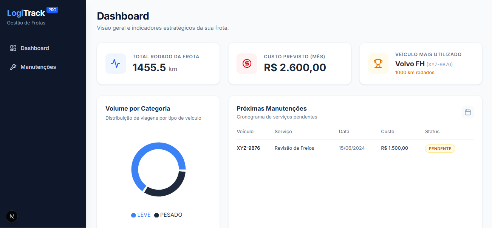
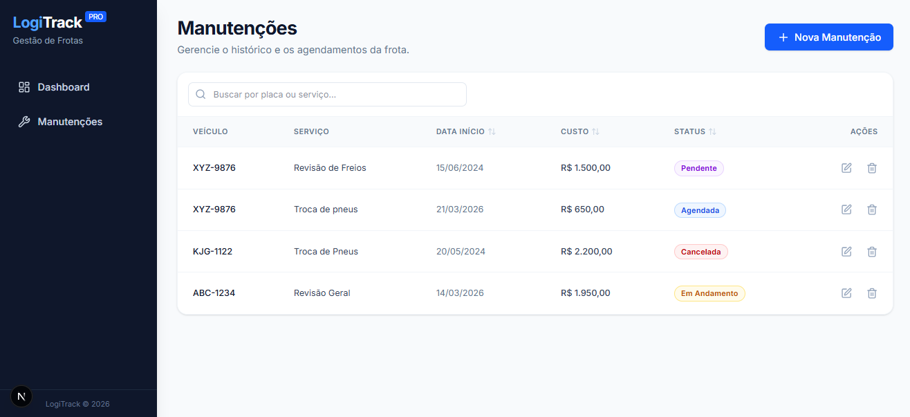
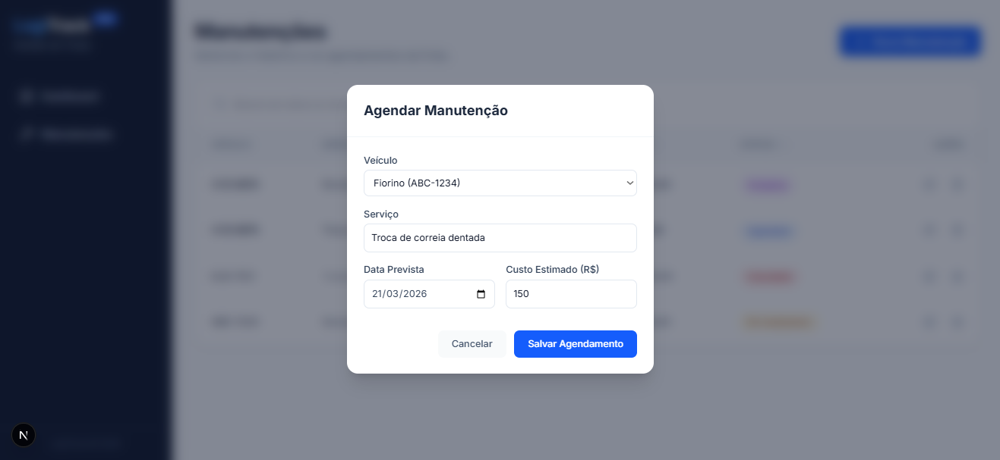

# 🚚 LogiTrack Pro


## 📖 Sobre o Projeto
O **LogiTrack Pro** é um MVP (Mínimo Produto Viável) de um sistema web desenvolvido para centralizar a gestão de frotas e fornecer inteligência de dados para uma empresa fictícia do setor de logística e transportes. O objetivo é substituir o controle feito em planilhas isoladas, resolvendo problemas de erros de agendamento e falta de previsibilidade de custos.

Este projeto foi desenvolvido como solução para o Desafio Técnico da LogAp I.T. Solutions.

---

## ⚙️ Funcionalidades Implementadas

Atendendo rigorosamente aos requisitos do desafio, o sistema contempla:

### 1. Módulo de Agendamento de Manutenção (CRUD Completo)
Implementação da Opção 2 do desafio, permitindo o controle total sobre o ciclo de vida das manutenções da frota.
* **Campos mapeados:** Seleção de Veículo, Data de Início, Data de Finalização prevista, Tipo de Serviço, Custo Estimado e Status[cite: 16].
* **UX/UI Avançada:** Busca reativa em tempo real, ordenação de colunas (Data, Custo, Status) diretamente na tabela do front-end e dicionário visual de cores para os status.

### 2. Dashboard de Análise de Dados
Painel estratégico focado em 5 métricas extraídas via consultas SQL:
* **Total de KM percorrido:** Soma da quilometragem da frota.
* **Volume por Categoria:** Quantidade de viagens filtradas por tipo de veículo (Leve vs Pesado).
* **Cronograma de Manutenção:** Listagem das próximas 5 manutenções agendadas, ordenadas por data.
* **Ranking de Utilização:** Identificação do veículo com a maior soma de quilometragem.
* **Projeção Financeira:** Soma do custo total estimado em manutenções para o mês atual.

---

## 📸 Demonstração

### Dashboard estratégico


### Gestão de Manutenções (Tabela e Busca)


### Cadastro e Edição


---

## 🛠️ Decisões de Arquitetura e Tecnologias

Optamos por uma stack moderna e uma separação estrita de responsabilidades, alcançando os diferenciais propostos:

* **Back-end:** Construído com Spring Boot e Java 17+. Foco em uma arquitetura limpa com uso de DTOs (Data Transfer Objects) para otimizar os payloads enviados ao front-end.
* **Front-end:** Interface moderna construída em React utilizando o framework **Next.js 15**, TypeScript e Tailwind CSS. A tipagem foi centralizada, e a renderização dividida estrategicamente entre *Server Components* (para fetch rápido) e *Client Components* (para interatividade). O código segue padrões rigorosos de formatação com ESLint e Prettier.
* **Banco de Dados (Justificativa de Alteração):** Conforme permitido, o script SQL original foi refatorado. As tabelas base foram ajustadas para garantir maior integridade referencial e facilitar a extração ágil dos dados para o Dashboard. Implementamos também o mapeamento em ENUM para os status das manutenções no Java, refletindo os estados exatos no banco para manter a consistência.

---

## 📋 Pré-requisitos

Antes de começar, certifique-se de ter as seguintes ferramentas instaladas na sua máquina:
* **Java 17** ou superior
* **Node.js** (v18 ou superior)
* **Docker** e **Docker Compose** (Para subir o banco de dados)

---

## 🚀 Como Configurar e Rodar o Projeto Localmente

Para facilitar a avaliação e o setup do ambiente, utilizamos o Docker para orquestrar o banco de dados (Diferencial DevOps). Siga o passo a passo abaixo estritamente nesta ordem:

### Passo 1: Subir a Infraestrutura (Banco de Dados via Docker)
1. Certifique-se de que o Docker está rodando na sua máquina.
2. Na raiz do projeto, execute o comando:
   ```bash
   docker-compose up -d
   ```
3. **Aguarde cerca de 10 segundos** antes de ir para o próximo passo. O PostgreSQL precisa desse tempo para inicializar e executar o script SQL de criação das tabelas pela primeira vez.

    *(Nota: Se preferir não utilizar o Docker, crie um banco PostgreSQL local manualmente com o nome logitrack_db e configure as credenciais verificando o arquivo src/main/resources/application.properties do back-end).*

### Passo 2: Back-end (Spring Boot)
1. Navegue até a pasta do back-end.
2. Caso esteja usando Linux ou macOS, dê permissão de execução ao Maven Wrapper:
    ```bash
    chmod +x mvnw
    ```
3. Execute o projeto:
    ```bash
    ./mvnw spring-boot:run
    ```

    *A API estará rodando em http://localhost:8080.*

### Passo 3: Front-end (Next.js)
1. Abra um novo terminal e navegue até a pasta do front-end.
2. Instale as dependências:
    ```bash
    npm install
    ```
3. Inicie o servidor de desenvolvimento:
    ```bash
    npm run dev
    ```

    *Acesse a aplicação no navegador em http://localhost:3000.*

---
*Projeto desenvolvido por Thiago Pereira - 2026*